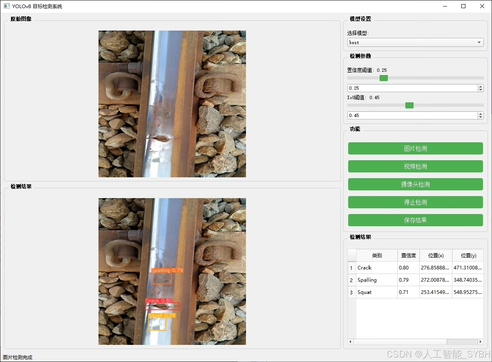
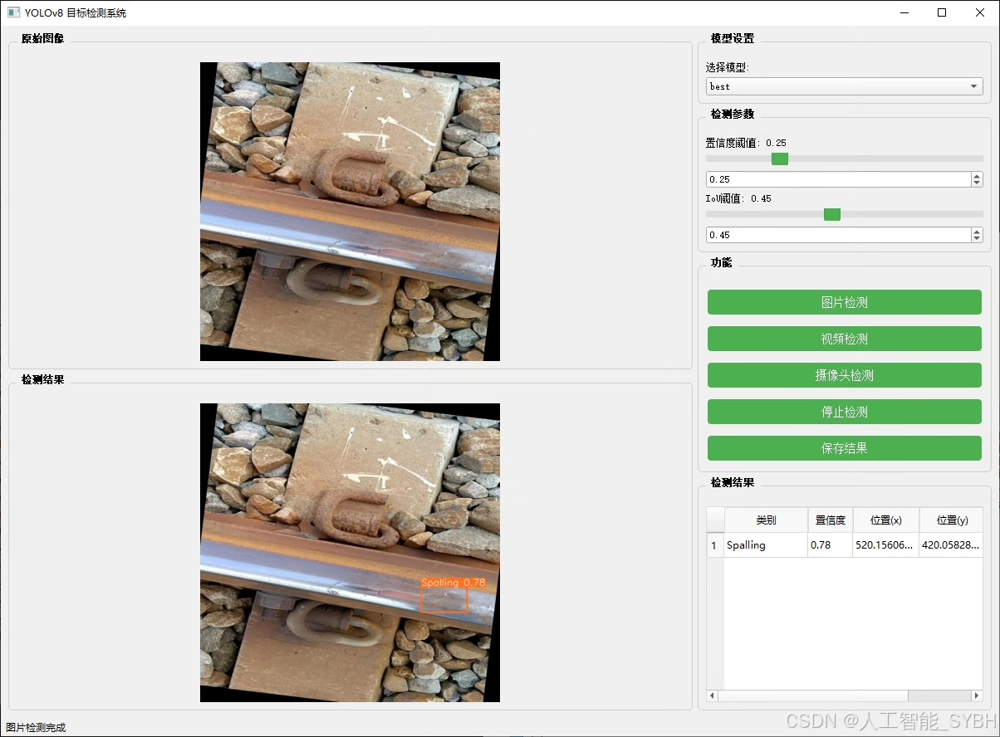
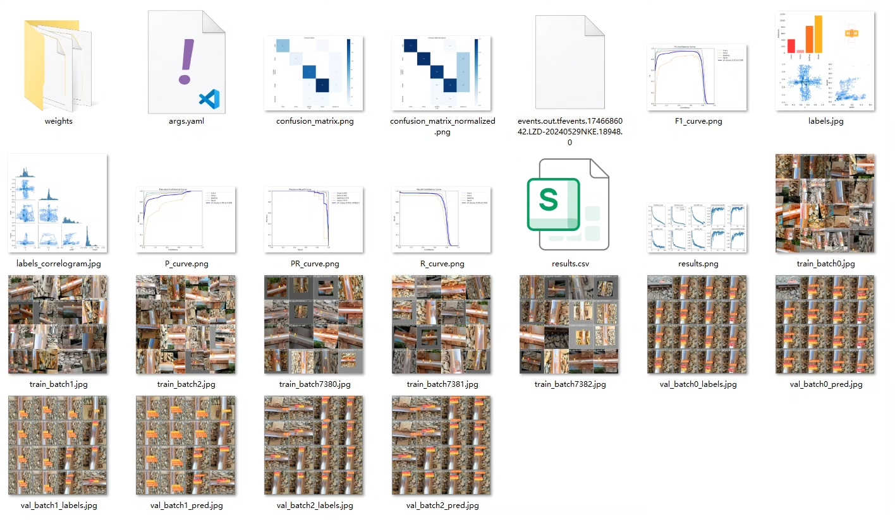
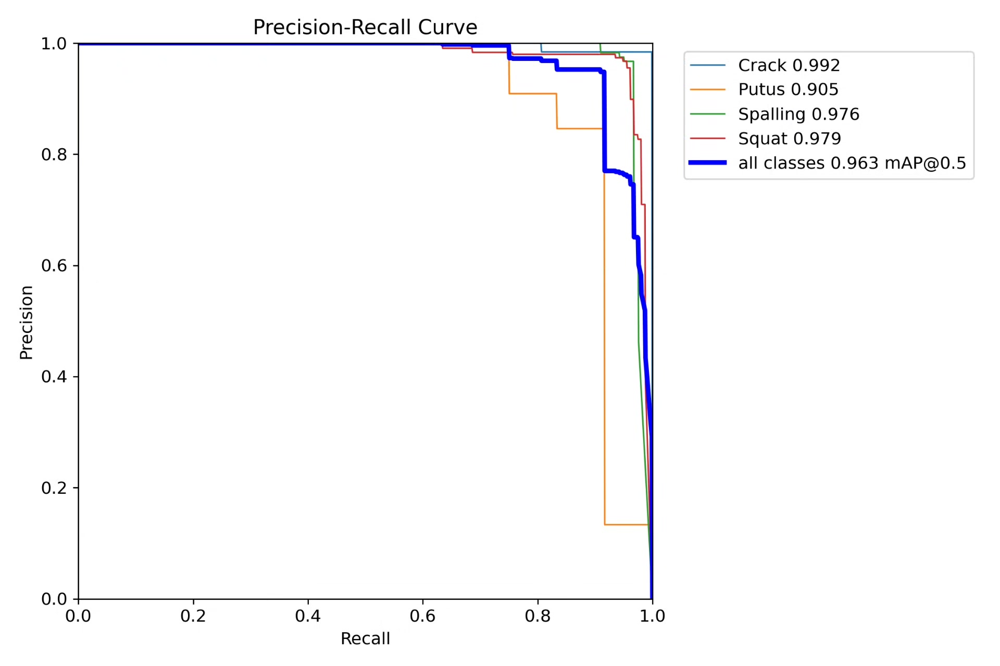
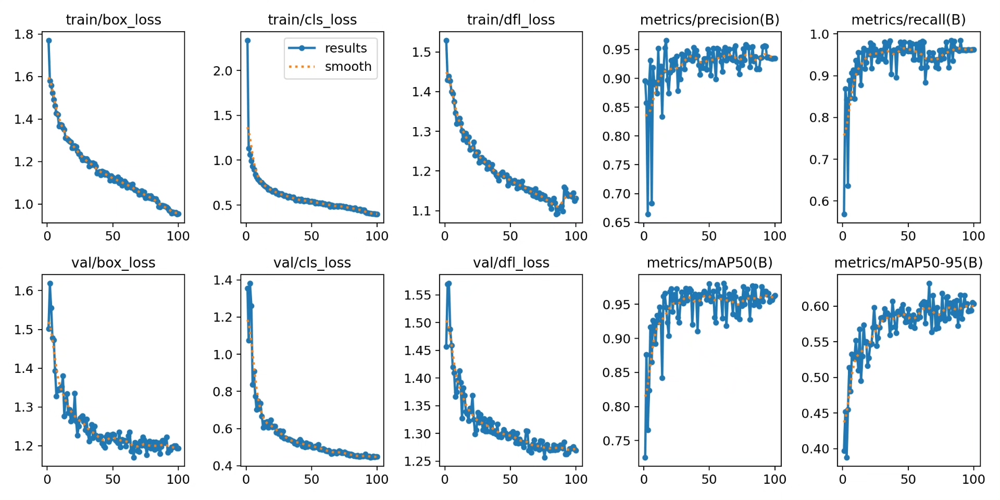
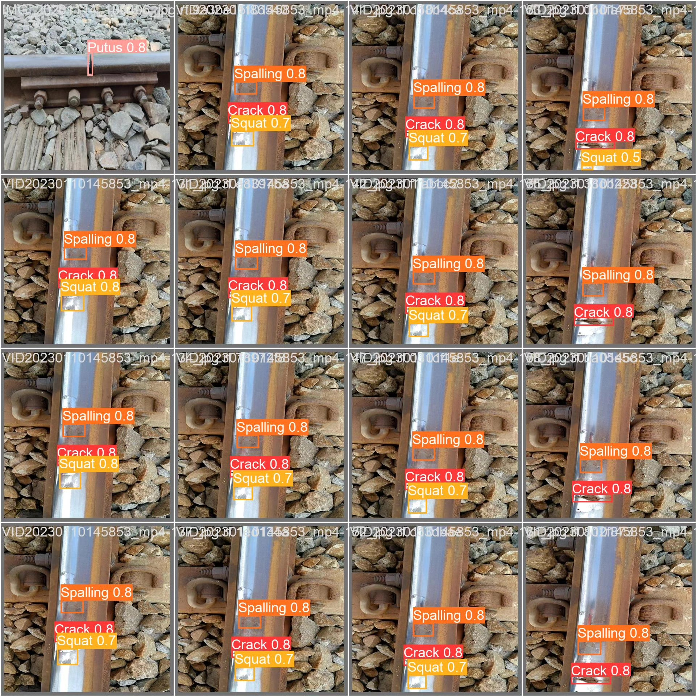
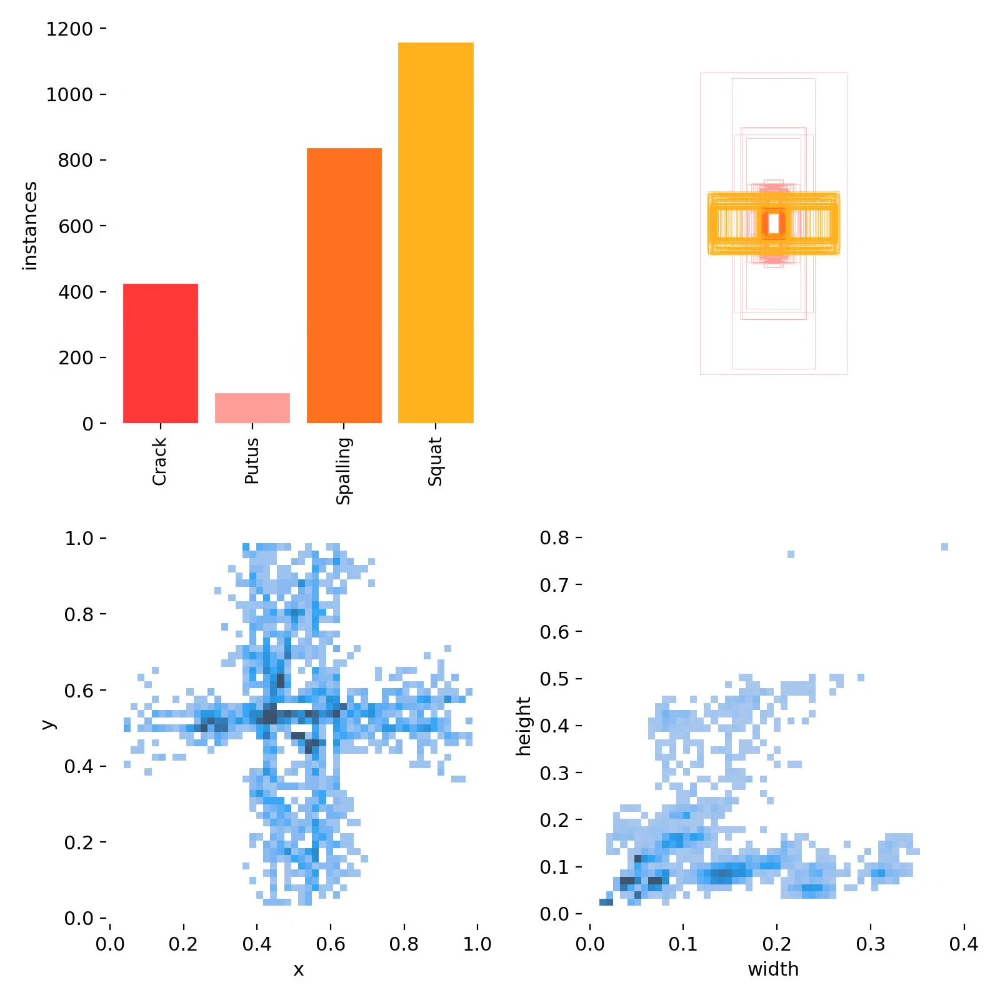
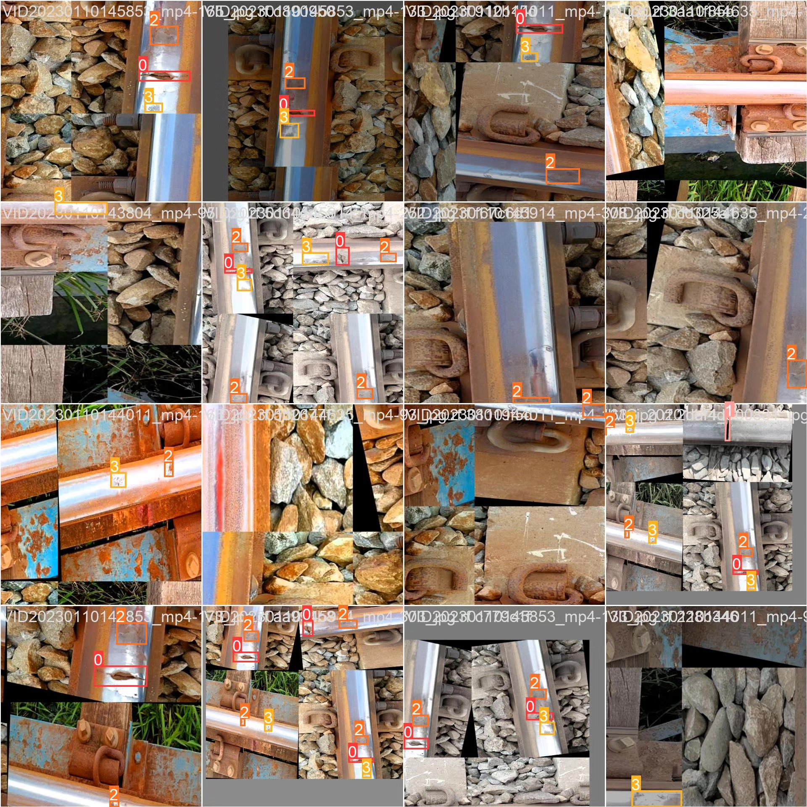

# Based on deep learning YOLOv8, the railway track defect detection system

## Body

Based on the advanced YOLOv8 object detection algorithm, this project has developed a highly efficient and accurate intelligent railway track defect detection system. It is specifically designed to identify and locate four typical defects on the surface of rail tracks: cracks, broken rails (Putus), spalling, and buckling (Squat). The system utilizes a professional-built railway track defect dataset for training and validation, including 1312 training images, 184 validation images, and 97 test images with high-quality labels, totaling 1593 finely labeled rail defect samples. This detection system can analyze the state of the rail surface in real-time, accurately identify the location and type of various defects, providing an intelligent detection tool for railway maintenance departments, significantly improving the efficiency of rail inspection and the accuracy of defect recognition. Experimental verification shows that the system performs excellent detection performance on the test set, with an average precision (mAP) reaching industrial application standards, possessing practical deployment value.

The company's products have obtained YOLO official commercial license certification.

We provide after-sales service

After payment, we will provide WeChat ID for any questions you may have at any time

Environment configuration: We will provide a tutorial on environment configuration, and WeChat will provide答疑

Remote installation service: If you need remote configuration, an additional fee of 69 is required,
If the configuration fails, all fees are refundable (only refund installation fees for special old computers)

Retraining dataset: After setting up the environment, you can train on your own computer.
If you need us to retrain, just pay 69 + computing power fees (2.5 yuan/hour)

Full after-sales service

## Images

## Payment

Here is a pay link on Stripe ( https://buy.stripe.com/3cs8yP7sY87d0vu9AB ). Please contact me lonlonago@foxmail.com after funding $89, and I will send you a complete data files , thank you!

